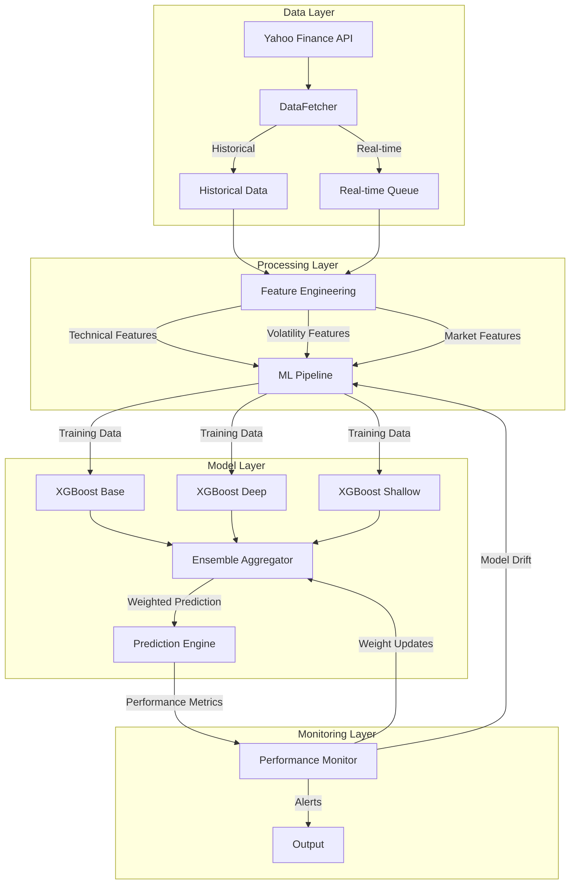

# ATLAS: Advanced Time-series Learning and Analysis System


[](https://discord.gg/agora-999382051935506503) [](https://www.youtube.com/@kyegomez3242) [](https://www.linkedin.com/in/kye-g-38759a207/) [](https://x.com/kyegomezb)


[](https://github.com/The-Swarm-Corporation/Legal-Swarm-Template)
[](https://github.com/kyegomez/swarms)


### I. System Architecture Overview

#### A. Data Infrastructure
1. Primary Data Pipeline
   - Historical data ingestion (10-year lookback)
   - Real-time minute-bar processing
   - Multi-threaded data collection
   - Fault-tolerant queue management

2. Feature Processing
   - Numba-accelerated computations
   - Multi-timeframe analysis (5D, 21D, 63D, 252D)
   - Market microstructure indicators
   - Technical analysis synthesis

#### B. Model Architecture
1. Ensemble Framework
   - Base XGBoost (balanced configuration)
   - Deep XGBoost (complex pattern recognition)
   - Shallow XGBoost (noise reduction)

2. Adaptive Learning System
   - Dynamic weight adjustment
   - Performance-based model selection
   - Automated retraining triggers
   - Cross-validation with time series constraints

### II. Strategic Capabilities

#### A. Risk Analytics
1. Volatility Forecasting
   ```python
   - Close-to-close: σ_cc = std(returns) * √252
   - Parkinson: σ_p = √(1/4ln(2)) * std(ln(High/Low)) * √252
   - Garman-Klass: σ_gk = √((ln(High/Low))² - (2ln(2)-1)(ln(Close/Open))²)
   ```

2. Market Regime Detection
   - Volatility regime classification
   - Volume profile analysis
   - Price action characterization
   - Momentum factor integration

#### B. Production Features
1. Performance Optimization
   - Numba JIT compilation
   - Vectorized operations
   - Thread-safe implementations
   - Memory-efficient data handling

2. Risk Management
   - Real-time monitoring
   - Automated alerts
   - Performance degradation detection
   - Data quality validation

### III. Implementation Strategy

#### A. Deployment Architecture

1. System Requirements
   - CPU: Multi-core processor (8+ cores recommended)
   - RAM: 32GB minimum for multi-asset deployment
   - Storage: SSD with 500GB+ for historical data
   - Network: Low-latency connection required

#### B. Operational Parameters
1. Model Configuration
   ```python
   XGBoost Base:
   - n_estimators: 200
   - max_depth: 6
   - learning_rate: 0.05
   
   XGBoost Deep:
   - n_estimators: 300
   - max_depth: 8
   - learning_rate: 0.03
   
   XGBoost Shallow:
   - n_estimators: 150
   - max_depth: 4
   - learning_rate: 0.1
   ```

2. Monitoring Thresholds
   - Model drift: 10% performance degradation
   - Data quality: 95% completeness required
   - Latency: Max 100ms processing time
   - Memory usage: 80% threshold for alerts

### IV. Performance Metrics

#### A. Model Evaluation
1. Statistical Measures
   - R² score (time series cross-validation)
   - Mean Absolute Percentage Error (MAPE)
   - Directional Accuracy
   - Information Ratio

2. Risk Metrics
   ```python
   def calculate_risk_metrics(returns):
       var_95 = np.percentile(returns, 5)
       cvar_95 = returns[returns <= var_95].mean()
       volatility = np.std(returns) * np.sqrt(252)
       return var_95, cvar_95, volatility
   ```

#### B. System Performance
1. Operational Metrics
   - Data pipeline latency
   - Model prediction time
   - Memory utilization
   - CPU load distribution

2. Quality Assurance
   - Data completeness checks
   - Feature stability monitoring
   - Model convergence validation
   - Prediction confidence scoring

### V. Strategic Applications

#### A. Trading Integration
1. Signal Generation
   - Volatility regime-based signals
   - Risk-adjusted position sizing
   - Dynamic hedge ratios
   - Execution timing optimization

2. Risk Management
   - Portfolio VaR calculations
   - Stress testing scenarios
   - Correlation analysis
   - Liquidity risk assessment

#### B. Market Analysis
1. Regime Classification
   - Volatility state identification
   - Trend strength measurement
   - Market stress indicators
   - Liquidity conditions

2. Alpha Generation
   - Volatility premium capture
   - Mean reversion opportunities
   - Momentum factor timing
   - Cross-asset correlations

### VI. Future Development Roadmap

#### A. Technical Enhancements
1. Model Improvements
   - Deep learning integration
   - Alternative data incorporation
   - Real-time feature selection
   - Automated hyperparameter optimization

2. Infrastructure Upgrades
   - Distributed computing support
   - GPU acceleration
   - Low-latency data feeds
   - Cloud deployment options

#### B. Feature Extensions
1. Additional Capabilities
   - Options data integration
   - Sentiment analysis
   - Cross-asset spillover effects
   - Regulatory risk metrics

2. Visualization Tools
   - Real-time dashboards
   - Risk heat maps
   - Performance attribution
   - Alert visualization

### VII. Production Considerations

#### A. Risk Controls
1. System Safeguards
   - Automatic failover mechanisms
   - Data validation checks
   - Model performance monitoring
   - Error handling protocols

2. Operational Procedures
   - Daily model validation
   - Weekly performance review
   - Monthly strategy assessment
   - Quarterly system audit

#### B. Documentation Requirements
1. Technical Documentation
   - API specifications
   - System architecture
   - Model documentation
   - Code documentation

2. Operational Documentation
   - Running procedures
   - Troubleshooting guides
   - Recovery procedures
   - Maintenance schedules

### VIII. Conclusion

ATLAS represents a comprehensive risk analysis framework designed for institutional-grade deployment. Its robust architecture, sophisticated modeling approach, and extensive monitoring capabilities make it suitable for production environments requiring high reliability and accuracy in risk assessment and prediction.

The system's modular design and strategic implementation allow for continuous improvement and adaptation to changing market conditions, while maintaining strict performance and reliability standards necessary for mission-critical financial applications.

## Diagram




## 📬 Contact

Questions? Reach out:
- Twitter: [@kyegomez](https://twitter.com/kyegomez)
- Email: kye@swarms.world

---

## Want Real-Time Assistance?

[Book a call with here for real-time assistance:](https://cal.com/swarms/swarms-onboarding-session)

---

⭐ Star us on GitHub if this project helped you!
